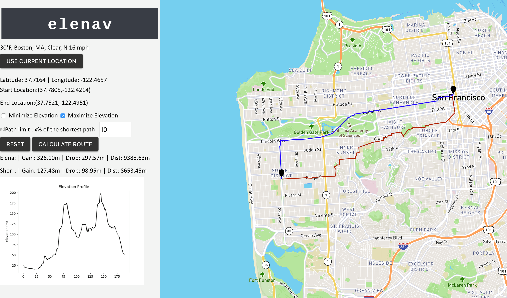

# Elevation-Navigation

- Make `start` an executable by running `chmod +x start`
- Before running the executable ensure that you're in an environment with osmnx and networkx (apart from other dependencies in requirements.txt) installed. 
- ```./start``` To start up the application. 
- Head over to `http://127.0.0.1:5000/mapbox_gl_new` on preferably Google Chrome to use the web interface. 
- To run the tests run `python test/test.py` from the home directory


# Behind the scenes

- Our algorithm runs different weighting mechanism of Dijkstra's and chooses the one that it considers best
- Our current system assumes that the user will only be querying in areas around San Fransisco. If a user queries outside this area, our algorithm will not work (the user will see a popup in this case). Even within San Fransisco, we have restricted ourselves to a radius of 20 km.
- If a user wishes to try with a different start location they should delete the file `graph.p` and then try for a route within their required location. The system will download the new graph object and then work as expected. Note, downloading the graph may take time. The user would also have to generate their api key to get the elevation data and add that in `elenav/model/config.py` 
